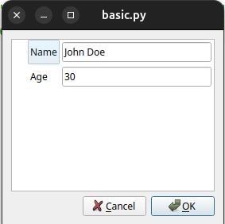
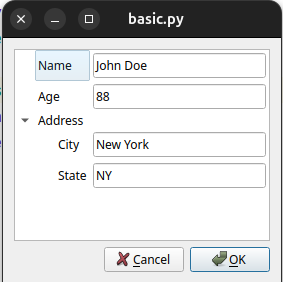

# EasyConfig

Easyconfig is a library for creating settings dialogs based in the pyQt 
Library. It eases the process of creating and managing configuration dialogs.
With `EasyConfig`, developers can quickly generate dialogs that allow users
to modify application settings, making it an efficient tool for enhancing 
user experience in pyQt applications. 

The API is simple and intuitive,
allowing developers to focus on the functionality of their applications 
rather than the intricacies of dialog creation. By leveraging `EasyConfig`, 
developers can streamline their workflow and enhance the overall user 
experience in pyQt applications.

### Philosophy

To use the library, it is necessary to create an `EasyConfig2` object and 
add the needed configuration options.

A basic settings dialogs can be created with the following code:

```python
config = EasyConfig2()
name = config.root().addString("name", pretty="Name", default="John Doe")
age = config.root().addInt("age", pretty="Age", default=30)
```
The options are organized as a tree, with the `root()` method returning the
root node of the tree which is an `EasyNode`. Additional nodes can be added to the tree using the `addString`,
`addInt`, etc. methods. Each of these methods return another `EasyNode` that can be used to add 
more options to the tree as we'll se later.

The first parameter of tha `addString` and `addInt` methods is the key value for
the node that will be used to access the value of the option and also the key that will be used 
in the yaml when it is created. The `pretty` parameter is the label that
will be shown in the dialog.

In the previous example we create a dialog with two options, one for the name and
another for the age of an individual. The name is a string with the default value "John Doe"
and the age is an integer with the default value 30.

Calling the `edit` method of the `EasyConfig2` object within a pyQt application
will show the dialog to the user.

Let's see a complete example:

```python
import sys
from PyQt5.QtWidgets import QApplication
from easyconfig2.easyconfig import EasyConfig2

app = QApplication(sys.argv)

config = EasyConfig2()
name = config.root().addString("name", pretty="Name", default="John Doe")
age = config.root().addInt("age", pretty="Age", default=30)

config.edit()
```



The dialog will show the two options and the user can change the values
and press the OK button to close the dialog. The values will be stored in the
`config` object and can be accessed by the application using the `get` method of the 
EasyNode object:

```python
name_value = name.get()
age_value = age.get()
``` 

Additionally, values can be set using the `set` method of the `EasyNode` object:

```python
name.set("Jane Doe")
age.set(25)
```

The changed will be also reflected in the dialog if it is still open.

### Save data

The data can be saved to a yaml file using the `save` method of the `EasyConfig2` object:

```python
config.save("config.yaml")
```
and can be read back using the `load` method:

```python
config.load("config.yaml")
```

Let's see another complete example:

```python
import sys
from PyQt5.QtWidgets import QApplication
from easyconfig2.easyconfig import EasyConfig2

app = QApplication(sys.argv)

config = EasyConfig2()
name = config.root().addString("name", pretty="Name", default="John Doe")
age = config.root().addInt("age", pretty="Age", default=30)
config.load("config.yaml")

if config.edit():
    config.save("config.yaml")

print("Name:", name.get())
print("Age:", age.get())

sys.exit(app.exec_())
```
Notice that the `load()` method **must** be called after the options have been added to the dialog
because the `EasyConfig2` object will read only the values that have been previously added.

This example will generate the following `yaml` file:

```yaml
name: Jane Doe
age: 25
```

The values will be read back from the file and shown in the dialog. If the user
presses the OK button the values will be saved back to the file.

### Use of subsections
It is possible to create subsections in the dialog by creating a new `EasyNode` object
and adding it to the root node. The subsections can have its own options and can be
expanded or collapsed by the user.

```python
config = EasyConfig2()
name = config.root().addString("name", pretty="Name", default="John Doe")
age = config.root().addInt("age", pretty="Age", default=30)

section = config.root().addSubsection("address", pretty="Address")
city = section.addString("city", pretty="City", default="New York")
state = section.addString("state", pretty="State", default="NY")
```
This will show a dialog with a section called "Address" that can be expanded or collapsed:



The corresponding yaml file will be:

```yaml
name: Jane Doe
age: 88
address:
  city: New York
  state: NY
```

Notice that all the parameters specified for a subsection are inherited by the options below it.
For example, if the `hidden` parameter is set to `True` in the subsection, all the options below it will be hidden.
```python
private_section = config.root().addSubsection("private_data", hidden=True)
ssn = private_section.addString("ssn", pretty="SSN", default="123-45-6789")
```

In this case, the private_data section will be hidden in the dialog but the values will be saved in the yaml file
and can be accessed by the application in the same way as the other options.

### Available EasyNode objects
The addString, `addInt`, `addFloat`, etc. methods are wrapper for a more general
method called `add_child` that can be used to add any kind of objects derived from `EasyNode`.
For example the `addString` method is equivalent to:

```python
name = config.root().add_child(EasyInputBox("name", pretty="Name", default="John Doe"))
```

Every node derived from `EasyNone` (e.g. `EasyInputBox`) has a set of parameters that can be used to customize the behavior of the option.
The following table shows the available options common to all `EasyNode` objects:

- `key`: The key value for the node that will be used to access the value of the option and also the key in the yaml file that will be saved.
- `pretty`: The label that will be shown in the dialog for this node.
- `default`: The default value of the option.
- `hidden`: If `True` the option will be hidden in the dialog but the value will be saved in the yaml file.
- `base64`: If `True` the value will be saved in the yaml file as a base64 encoded string.
- `immediate`: If `True` the signal will be emitted immediately when the value is changed (see below).

These are the available options available, their wrapper and the parameters that can be used:

#### Subsection
- `EasySubsection` (`addSubsection`) - A subsection that can be expanded or collapsed by the user.
  


#### Text and Numbers
- `EasyInputBox` (`addString`) - A string option that can be edited by the user.
  - `validator`: A `QValidator` object that will be used to validate the input.
  - `readonly`: If `True` the option will be shown as read-only and the user will not be able to change the value.
  
- `EasyInt` (`addInt`) - An integer value that can be edited by the user.
  - `readonly`: If `True` the option will be shown as read-only and the user will not be able to change the value.

- `EasyFloat` (`addFloat`) - A float value that can be edited by the user.
  - `readonly`: If `True` the option will be shown as read-only and the user will not be able to change the value.

#### Selection

- `EasyCheckBox` (`addCheckBox`) - A checkbox option that can be checked or unchecked by the user.
- `EasyComboBox` (`addComboBox`) - A combobox option that can be selected by the user.
  - `items`: A list of strings with the items that will be shown in the combobox.

#### Slider
- `EasySlider` (`addSlider`) - A slider option that can be used to select a value in a range.
  - `min`: The minimum value of the slider.
  - `max`: The maximum value of the slider.
  - `den`: The denominator of the slider. The value of the slider will be multiplied by this value.
  - `suffix`: A string that will be shown after the value of the slider.
  - `show_value`: If `True` the value of the slider will be shown in the dialog.
  - `format`: A string that will be used to format the value of the slider (e.g. "%.2f").
  - `align`: The alignment of the value of the slider. It can be `left`, `right` or `center`.

#### Files
- `EasyFileDialog` (`addFolderChoice, addFileChoice`) - A file dialog that can be used to select a file or a folder.
  - `extension`: A string with the extension of the file that will be shown in the dialog.
  - `type`: The type of the file dialog. It can be `file` or `dir`.

### Advanced use
Every node, excluding the root node, has a set of signals that can be used to be warned when the value of the node is changed.
For example, the `value_changed` signal is emitted when the value of the node is changed by the user. The `value_changed` signal
has a parameter that is the new value of the node.

The following example shows how to connect a slot to the `value_changed` signal of a node:

```python
city.value_changed.connect(lambda n: print("City changed to", n.get()))
state.value_changed.connect(lambda n: print("State changed to", n.get()))
```

The `value_changed` signal is emitted when the value of the node is changed editing the dialog. The `value_changed` signal
has a parameter that is the object that emitted the signal.
Notice that if the signals are connected **before** the configuration is loaded the signals will be emitted 
when the configuration is loaded.

### Dependencies
It is possible to configure dependencies between nodes. For example, it is possible to enable or disable a node or section
depending on the value of another node or enable and disable the OK button. The `EasyNode2` object has a method called `add_dependency` that can be used
to add a dependency between nodes. There are two types of dependencies: EasyMandatoryDependency and EasyPairDependency.

The EasyMandatoryDependency is used to enable or disable the OK button if the dependency is not satisfied. 
The EasyPairDependency is used to enable or disable a node or section depending on the value of another node.
For example, the following code will disable the address section if the age is less or equal to 18:

```python
config.add_dependency(EasyPairDependency(age, section, lambda x: x > 18))
```
The EasyPairDependency has three parameters: the node that will be used to check the dependency, the node that will be enabled or disabled
and a function that will be used to check the dependency. The function must have a parameter that is the value of the node that will be used to check the dependency.

The following code will disable the OK button if the name is empty:

```python
config.add_dependency(EasyMandatoryDependency(name, lambda x: x != ""))
```

The EasyMandatoryDependency has two parameters: the node that will be used to check the dependency and a function that will be used to check the dependency. The lambda function has a parameter that is the value of the node that will be used to check the dependency.
